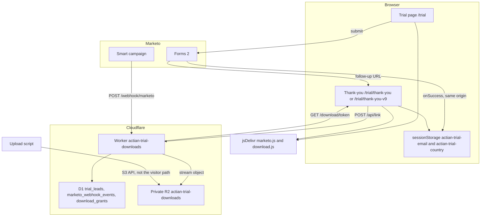
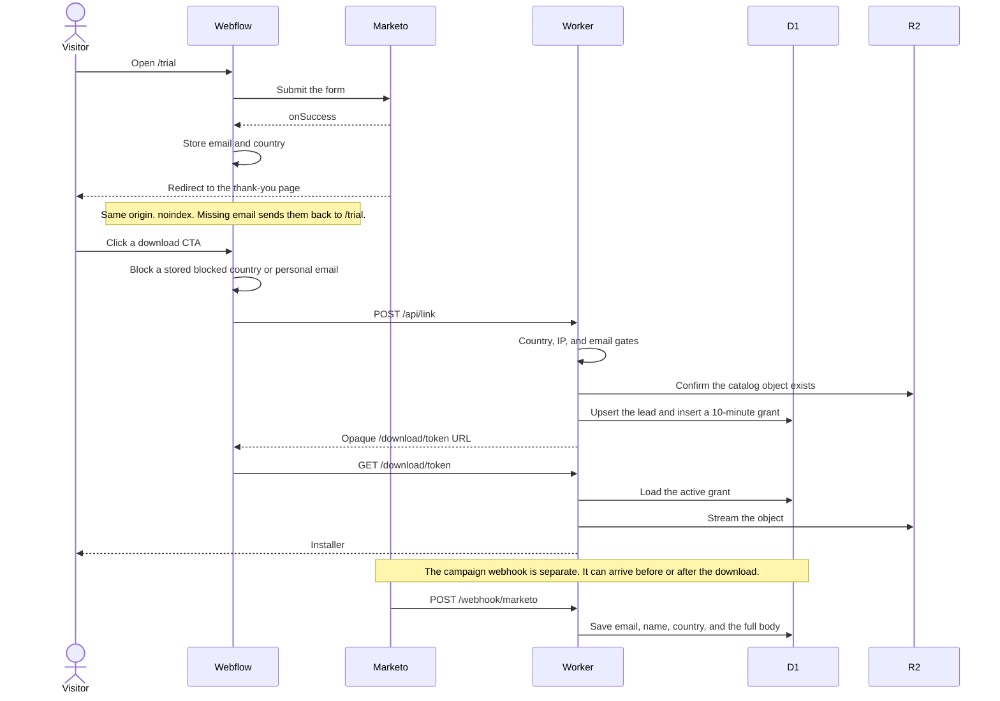
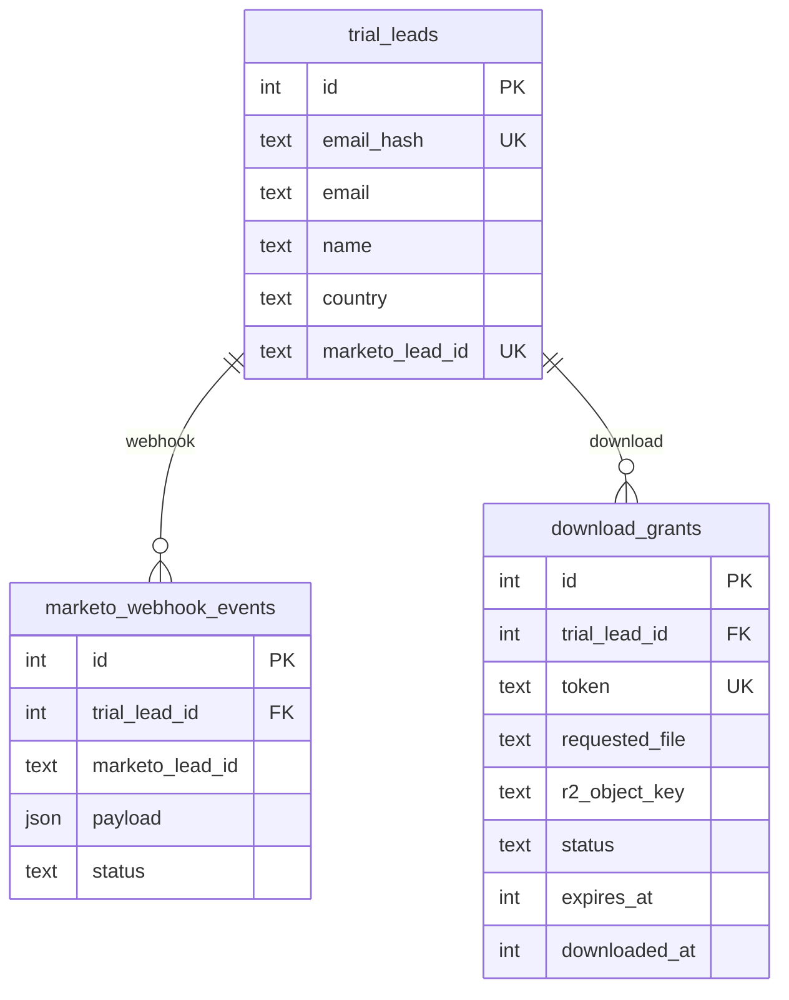

# Actian trial downloads

pnpm monorepo with a Webflow/Marketo frontend package and a Cloudflare Worker backend.

```
packages/
  frontend/   # script loaded on the trial page
  server/     # gated R2 download Worker + S3 upload script
```

## System map

Visitors never touch R2. Webflow hosts the pages, Marketo captures the lead, and the Worker is the only thing that can read an installer.







What each part owns:

| Piece | Role |
| --- | --- |
| Webflow `/trial` | Hosts the Marketo form and loads `marketo.js`. |
| Webflow `/trial/thank-you` and `/trial/thank-you-v9` | Host the OS tabs and load `download.js`. Locale prefixes are kept (`/de/trial/thank-you` sends an empty session back to `/de/trial`). |
| `marketo.js` | Polls up to 15 seconds for `MktoForms2`, then on success writes `actian-trial-email` and `actian-trial-country`. Returns `true` so Marketo redirects. |
| `download.js` | On a thank-you path, sets `noindex, nofollow`. With no stored email, replaces the location with the trial page and does not bind downloads. Otherwise blocks a stored blocked country or personal email before `POST /api/link`. |
| Marketo form | Lead system of record. A personal email is still submitted here; the thank-you page and the Worker refuse the file. |
| Marketo webhook | Server-to-server `POST /webhook/marketo`. JSON token encoding must not quote tokens, because Marketo adds the quotes. The body needs an `email` field. `country` is stored only when the template sends `{{lead.Country}}`. |
| Worker | Gates the request, resolves `metadata` through the catalog, writes D1, and streams R2. The download URL is an opaque D1 token, not an R2 presigned URL. Default life is 600 seconds. |
| D1 `trial_leads` | One person. `email`, `name`, `country`, `company`, `product`, `url_on_submit`, and `version` come from the webhook. `cf_country` is the latest Cloudflare country from a link or download request. A download updates `email` and `cf_country` and leaves the webhook fields in place. |
| D1 `marketo_webhook_events` | One callback. `payload` is the full submitted body. |
| D1 `download_grants` | One issued link. `issued_country` is the Cloudflare country on `POST /api/link`. `download_country` is the Cloudflare country when the file streams. |
| R2 | Private bucket. The browser cannot read it. Operators upload with `pnpm upload`. |
| jsDelivr | Serves the committed `packages/frontend/dist` files, pinned to a git commit. A local rebuild is not live until that pin changes. |

Gates, in the order a visitor hits them:

| Check | Where | Result |
| --- | --- | --- |
| Thank-you page with no stored email | `download.js` | Redirect to the trial page. |
| Form country `ru`, `sy`, `ir`, `kp`, `by`, `cu`, `cn`, `mm`, `ua`, `ve`, or the matching Marketo name | `download.js`, on load and on click | "Downloads are not available in your region." No `/api/link` call. |
| Personal email domain | `download.js`, on load and on click | "Downloads are limited to business email addresses." No `/api/link` call. |
| Cloudflare country and IP | Worker, on `/api/link` and `/download/:token` | `403` `country_blocked` or `ip_blocked`. Empty country is not blocked. `BLOCKED_IPS` is empty at launch. |
| Email domain | Worker, on `/api/link` only | `403` `email_blocked`. |
| Unknown `metadata` | Worker | `400` `invalid_file`. |
| Catalog key missing from R2 | Worker | `404` `not_found`. |

Country on the Worker is `request.cf.country`, then `CF-IPCountry`. That value is stored as `download_grants.issued_country` when the link is issued and as `download_grants.download_country` when the file streams. The latest of those is also `trial_leads.cf_country`. It does not replace `trial_leads.country`, which stays the webhook country. IP is `CF-Connecting-IP`, then the first `X-Forwarded-For` address. The form country in `sessionStorage` is a second check in the browser; it is not sent to `/api/link`.

When the file streams, the Worker updates the Marketo lead with `updateOnly` on email, if `MARKETO_BASE_URL`, `MARKETO_CLIENT_ID`, and `MARKETO_CLIENT_SECRET` are set. `requested_file` goes to `ESD_Download_Marketo__c`, the R2 file name goes to `flexField1`, and the download time goes to `ESD_Download_Date__c`. The Marketo call does not block the file. Those three lead fields keep the latest download.

CORS echoes the request origin when `CORS_ORIGINS` is `*`. When that list is restricted, the Worker still allows `actian.com`, `jaspersoft.com`, `webflow.io`, and their subdomains.

## How this wires to the Webflow page

The thank-you page is OS tabs (Windows / Mac / Linux) with four download CTAs each. Two page scripts handle the flow. Local dev serves them from esbuild:

```html
<script type="module" src="http://localhost:3000/pages/marketo.js"></script>
<script type="module" src="http://localhost:3000/pages/download.js"></script>
```

Production loads the built files from jsDelivr, pinned to a git commit. After changing either script, commit the rebuilt `packages/frontend/dist` output and point Webflow at that commit. OneTrust must not auto-block jsDelivr or the Worker origin.

```html
<script
	defer
	src="https://cdn.jsdelivr.net/gh/BX-Studio-Webflow/actian-worker@<commit>/packages/frontend/dist/pages/marketo.js"
></script>
<script
	defer
	src="https://cdn.jsdelivr.net/gh/BX-Studio-Webflow/actian-worker@<commit>/packages/frontend/dist/pages/download.js"
></script>
```

`download.js` posts to `https://actian-trial-downloads.cf-jaspersoft.workers.dev`.

What the scripts do:

1. `marketo.js` waits up to 15 seconds for `MktoForms2`. The Webflow Marketo app loads `forms2.min.js` asynchronously, so a single check at startup usually runs before Forms 2 exists and never registers a handler.
2. On form success it stores `Email` (or `email`) in `sessionStorage` under `actian-trial-email` and `Country` under `actian-trial-country`, then returns `true` so Marketo follows its thank-you URL.
3. That thank-you URL must be the same origin as the form page. `sessionStorage` does not carry the email onto another host.
4. `download.js` handles clicks on `[dev-target="download-link"]`. The installer id is the anchor's `metadata` attribute: a catalog alias or a catalog R2 key. The original `href` is left in place and is only followed when `metadata` is empty or the script did not load.
5. The email is read from `sessionStorage`, then from an `Email` / `#Email` / `input[type="email"]` field in the parent document. The thank-you page has no form, so the stored key is required.
6. `POST /api/link` runs country / IP / email gating and returns a 10-minute opaque Worker URL.
7. The browser navigates to that URL; the Worker streams the private R2 object.

Download CTA:

```html
<a dev-target="download-link" metadata="jss-macos" href="#">Download</a>
```

Error surface. `download.js` removes `hide` from the wrapper and sets the text. `[dev-target="cancel"]` adds `hide` again.

```html
<div dev-target="error-wrapper" class="hide">
	<p dev-target="error-text"></p>
	<button type="button" dev-target="cancel">Close</button>
</div>
```

### File aliases (10.0.0)

| Tab | Product | Alias | R2 key |
| --- | --- | --- | --- |
| Windows | JasperReports Server | `jrs-windows` | `10.0.0/js-jrs_10.0.0_win_x86_64.exe` |
| Windows | Jaspersoft Studio | `jss-windows` | `10.0.0/js-jss_10.0.0_windows_x86_64.exe` |
| Windows | Web Studio | `jrws-windows` | `10.0.0/js-jrws-pro_10.0.0_windows_x86_64.zip` |
| Windows | IO Professional | `jrio-windows` | `10.0.0/js-jrio-pro_10.0.0_windows_x86_64.zip` |
| Mac | Server | `jrs-macos` | `10.0.0/js-jrs_10.0.0_macosx_x86_64.zip` |
| Mac | Studio | `jss-macos` | `10.0.0/js-jss_10.0.0_macosx_x86_64.dmg` |
| Mac | Web Studio | `jrws-macos` | `10.0.0/js-jrws-pro_10.0.0_mac_x86_64.zip` |
| Mac | IO Professional | `jrio-macos` | `10.0.0/js-jrio-pro_10.0.0_macos_x86_64.zip` |
| Linux | Server | `jrs-linux` | `10.0.0/js-jrs_10.0.0_linux_x86_64.run` |
| Linux | Studio | `jss-linux` | `10.0.0/js-jss_10.0.0_linux_x86_64.tgz` |
| Linux | Web Studio | `jrws-linux` | `10.0.0/js-jrws-pro_10.0.0_linux_x86_64.zip` |
| Linux | IO Professional | `jrio-linux` | `10.0.0/js-jrio-pro_10.0.0_linux_x86_64.zip` |

Catalog lives in `packages/server/src/utils/catalog.ts`. `/api/link` accepts either the alias or the R2 key from that table. Any other string, including the old Mac Studio path `10.0.0/js-jss_10.0.0_macosx_x86_64.zip`, returns `400` `invalid_file`. A catalog key that is not in the bucket returns `404` `not_found`. Redeploy the Worker after catalog changes; the running Worker keeps the catalog it was deployed with. Upload mapped installers with `pnpm upload` before expecting `200`.

## Upload to R2 (S3-compatible API)

1. In the Actian Cloudflare account, create the bucket `actian-trial-downloads` (private, no public access).
2. [Create an R2 API token](https://developers.cloudflare.com/r2/api/tokens/) with Object Read & Write on that bucket.
3. Put credentials in `packages/server/.dev.vars` (see `.dev.vars.example`):

```
R2_ACCOUNT_ID=...
R2_ACCESS_KEY_ID=...
R2_SECRET_ACCESS_KEY=...
R2_BUCKET_NAME=actian-trial-downloads
MARKETO_WEBHOOK_SECRET=...
LEAD_HASH_SECRET=...
```

4. Preview then upload (multipart, required for 300MB–1GB files):

```bash
pnpm upload:dry
pnpm upload
pnpm upload -- --skip-existing
```

The script walks `packages/server/downloads/`, skips the Google Drive wrapper zips, and PUTs mapped installers to `https://<ACCOUNT_ID>.r2.cloudflarestorage.com`.

## Worker gating (confirmed 8/25)

| Rule | Launch behavior |
| --- | --- |
| Business email | Block free/personal domains from the client list |
| Country | Block `ru`, `sy`, `ir`, `kp`, `by`, `cu`, `cn`, `mm`, `ua`, `ve` |
| IP | Capability present; no IPs blocked at launch |

Marketo still captures the lead on form submit. The thank-you page and the Worker refuse the installer afterward.

## Commands

| Command | Description |
| --- | --- |
| `pnpm dev` | Frontend (port 3000) and Worker |
| `pnpm upload:dry` / `pnpm upload` | List / upload installers to R2 |
| `pnpm test` | Worker tests |
| `pnpm deploy:server` | Deploy the Worker |
| `pnpm deploy:frontend` | Deploy the page script |

## Technical solution details

### Architecture

The solution replaces direct trial-download links with a gated, short-lived download flow. Installers live in a private Cloudflare R2 bucket and can only be downloaded through a Cloudflare Worker.

The diagram and table in [System map](#system-map) are the layout. The scripts are TypeScript compiled with esbuild. Webflow loads the committed `packages/frontend/dist` files through jsDelivr's GitHub CDN. The Worker applies access gates, writes short-lived opaque download grants to D1, and streams installer files from its private R2 binding. Marketo remains the form and lead-capture system. The same person is one `trial_leads` row, matched by the keyed email hash.

### Browser request flow

1. Webflow loads `marketo.js` and `download.js` from jsDelivr at a pinned commit. `download.js` calls `https://actian-trial-downloads.cf-jaspersoft.workers.dev`.
2. `marketo.js` polls until `MktoForms2` exists (15 seconds, every 100ms), then registers `whenReady` / `onSuccess`. Forms 2 still invokes `whenReady` for a form that is already on the page.
3. On success the module stores the submitted email in `sessionStorage` under `actian-trial-email` and the submitted country under `actian-trial-country`, then lets Marketo redirect. The thank-you page must be the same origin. `download.js` blocks the download when that country is `ru`, `sy`, `ir`, `kp`, `by`, `cu`, `cn`, `mm`, `ua`, or `ve`, or the matching Marketo label (`Russia`, `Syria`, `Iran`, `Korea, North`, `Belarus`, `Cuba`, `China`, `Myanmar`, `Ukraine`, `Venezuela`).
4. A visitor clicks an anchor matching `[dev-target="download-link"]`.
5. The module reads `metadata` for the file id. If `metadata` is present it cancels the click. If it is missing, the original `href` is left alone and an error is shown.
6. The module reads the email from session storage, then from a parent-document email field. If no email is available, it shows "Please submit the trial form before downloading." and does not call the Worker.
7. The module sends `POST /api/link` with `{ "email": "...", "file": "..." }`.
8. On success it navigates to the returned opaque URL. The Worker resolves the active D1 grant and streams the R2 object as an attachment. Other failures are written into `[dev-target="error-text"]`.

The browser never calls R2 directly. It makes the API request and then navigates to the Worker download endpoint.

### Webflow requirements

Load both built scripts. In production, `src` is the jsDelivr URL pinned to the commit that contains `packages/frontend/dist/pages/marketo.js` and `pages/download.js`.

```html
<script
	defer
	src="https://cdn.jsdelivr.net/gh/BX-Studio-Webflow/actian-worker@<commit>/packages/frontend/dist/pages/marketo.js"
></script>
<script
	defer
	src="https://cdn.jsdelivr.net/gh/BX-Studio-Webflow/actian-worker@<commit>/packages/frontend/dist/pages/download.js"
></script>
```

Each download CTA needs `dev-target="download-link"` and a `metadata` value that is a current catalog alias or R2 key, for example `metadata="jss-macos"` or `metadata="10.0.0/js-jss_10.0.0_macosx_x86_64.dmg"`. The Marketo form follow-up URL must stay on the same origin as the page that loaded `marketo.js`. Provide `[dev-target="error-wrapper"]`, `[dev-target="error-text"]`, and `[dev-target="cancel"]` for link errors.

### Worker API

| Route | Method | Purpose |
| --- | --- | --- |
| `/health` | `GET` | Returns `{ "ok": true, "status": "ok" }` for a health check. |
| `/api/link` | `POST` | Validates the file and requester, then creates an opaque D1-backed download grant. |
| `/download/:token` | `GET`, `HEAD` | Resolves an active grant and streams the private R2 object. |
| `/webhook/marketo` | `POST` | Stores the callback body and the lead's email, name, and country. Server-to-server only. Not a download gate. |

`/api/link` rejects malformed JSON bodies larger than 8 KiB, invalid email addresses, blocked emails/countries/IPs, and unknown files. It first verifies the R2 object exists, then stores the requested file and canonical R2 key in a D1 grant. The URL lifetime defaults to 600 seconds and is configurable with `LINK_TTL_SECONDS`.

`/download/:token` requires an active, unexpired grant. It passes `Range` and conditional request headers to R2, supports partial content responses, and returns `Cache-Control: private, no-store`, `Accept-Ranges: bytes`, `X-Content-Type-Options: nosniff`, attachment `Content-Disposition`, and R2 content metadata.

### Security and gating

Files resolve only through the built-in catalog plus optional `ALLOWED_FILES` overrides. Both aliases and explicit catalog keys are supported. Object keys reject traversal, backslashes, null bytes, invalid characters, leading slashes, and keys longer than 512 characters.

The Worker applies country and IP checks on both `/api/link` and `/download`. Country comes from Cloudflare request country data, with `CF-IPCountry` as a fallback. IP comes from `CF-Connecting-IP`, with `X-Forwarded-For` as a fallback. Default blocked countries are `ru`, `sy`, `ir`, `kp`, `by`, `cu`, `cn`, `mm`, `ua`, and `ve`; extra countries and IPs are configurable through comma-separated environment variables.

Email is validated and gated on `/api/link`. The default policy rejects consumer/free-mail domains; `EXTRA_BLOCKED_EMAIL_LABELS` can extend that list.

The Worker stores canonical R2 object keys only after server-side catalog resolution and R2 existence checks. `LEAD_HASH_SECRET` keys HMAC-SHA-256 email hashes used to correlate Marketo callbacks and download requests. `trial_leads` also stores the raw email, plus the name and country when the webhook sends them. A missing secret fails closed with a configuration error.

`/webhook/marketo` is not a download gate. It requires `MARKETO_WEBHOOK_SECRET` in `X-Webhook-Secret` or a `secret` query parameter, then records the authenticated callback in D1. The event row keeps the full submitted body. The lead row keeps the email, name, and country from that body. Prefer the header so the secret is not placed in URLs or logs.

### CORS and OneTrust

The Worker handles `OPTIONS` and permits `GET`, `HEAD`, `POST`, and `OPTIONS` with `Content-Type` and `Accept`. `CORS_ORIGINS` is currently `*`; restrict it in production to the Webflow and Actian origins that host the trial page. The Worker also recognizes `actian.com`, `jaspersoft.com`, and their subdomains, plus `webflow.io` subdomains.

For OneTrust, exempt from automatic blocking or categorize as Strictly Necessary, subject to legal review:

- `cdn.jsdelivr.net`, which delivers `marketo.js` and `download.js`.
- The configured Cloudflare Worker hostname or custom domain, which receives `POST /api/link` and serves opaque `/download` URLs.

Cloudflare R2 is server-side only, so it does not need a browser-side OneTrust exception. The R2 upload script and AWS SDK are operator tooling, not visitor-side dependencies.

Marketo is the form/lead-capture provider. `marketo.js` uses it to retain the email after form success, but its OneTrust category must follow the applicable privacy policy; this code does not establish it as Strictly Necessary. `download.js` can read a visible parent-document email field only when that field is still on the page. The thank-you page depends on `sessionStorage`.

If jsDelivr is blocked, neither script loads and CTAs navigate to their original `href` values. If the Worker domain is blocked, the click handler loads but cannot issue a link. Test both rejected-consent and accepted-consent states in an incognito browser.

### Configuration, deployment, and release validation

Worker bindings and non-secret configuration live in `packages/server/wrangler.jsonc`. Store `LEAD_HASH_SECRET` and `MARKETO_WEBHOOK_SECRET` as Cloudflare secrets with `wrangler secret put` for every deployed environment. Keep `R2_ACCOUNT_ID`, `R2_ACCESS_KEY_ID`, `R2_SECRET_ACCESS_KEY`, and `R2_BUCKET_NAME` only in `packages/server/.dev.vars`; do not commit them. Use different values per environment and rotate any secret exposed in chat, source control, an issue, or logs.

Generate migrations with `pnpm --filter @actian/server db:generate`. Apply the checked-in migration before deploying the Worker: `pnpm --filter @actian/server db:migrate:development` or `pnpm --filter @actian/server db:migrate:production`.

`pnpm deploy:frontend` publishes the compiled assets to Cloudflare Pages (`actian-frontend-assets`). The Webflow page does not use that Pages URL; it uses the jsDelivr GitHub URL, which changes only when the commit pin changes. `pnpm deploy:server` deploys the production Worker. `pnpm upload` transfers mapped installers to the private bucket through R2's S3-compatible endpoint and is not part of the visitor request flow.

Before release, confirm both Webflow scripts load from the intended jsDelivr commit, the Worker origin is OneTrust-permitted, a successful form submit leaves `actian-trial-email` and `actian-trial-country` in `sessionStorage` on the same-origin thank-you page, a blocked country shows the region error and does not request a link, an eligible CTA returns an opaque link, the Worker streams the file, unknown `metadata` returns `400` `invalid_file`, a missing object returns `404` `not_found`, and blocked email/country/IP cases are refused. Redeploy the Worker when `packages/server/src/utils/catalog.ts` changes.
